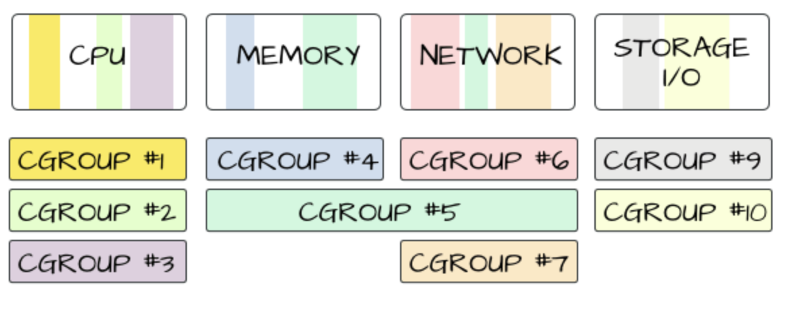

## Docker

### 도커 구성
- Docker Host (installed Docker Server)
  - Docker Server 
  - Docker Daemon (Docker Server에 내장, Docker API Server)

- Docker Client 
  - 도커 데몬이 제공하는 API를 사용해 상호 작용하는 것
    - CLI (Command Line Interface)
    - Docker Compose

- Container Repository 
  - Docker Hub (기본적으로 제공)
  - Hadoop

- Container (OCI 표)
  - 컨테이너 이미지의 실행 가능한 인스턴스이다.
  - 포트 포워딩,  포트 매핑이라는 프로세스를 통해 외부 세계에 자신의 서비스 포트 노출 가능 (즉 격리성을 갖는다.)
  - Container Image
    - 도커 내에서 어플리케이션을 실행하는 데 필요한 모든 것을 포함하는 실행 가능한 경량 패키지

---

### 도커는 어떻게 동작하는가?
> 도커는 namespace, cgroup기능을 활용하여 Host OS의 Kernel을 공유한다.

- namespace
  - 프로세스 별로 리소스 사용을 분리한다.
  - <u>Hardware Resource 자체를 가상화하는 것이 아니라, Linux 내의 자원을 가상화</u>한다.
  - pid name spaces : 프로세스 격리 처리 (독립된 프로세스 공간 할당)
  - net name spaces : 네트워크 인터페이스
  - ipc name spaces : IPC 자원에 대한 엑세스 관리
  - mnt name spaces : 파일 시스템 포인트 관리
  - uts name spaces : host name 할당

- cgroups (Control Groups 약자)
  - cgroups는 프로세스들이 사용할 수 있는 컴퓨팅 자원들을 제한하고 격리시킬 수 있는 리눅스 커널의 기능이다. 
  - cgroup를 이용하면 다음 자원들을 제한할 수 있다
    - 메모리
    - CPU
    - Network
    - Device   

    